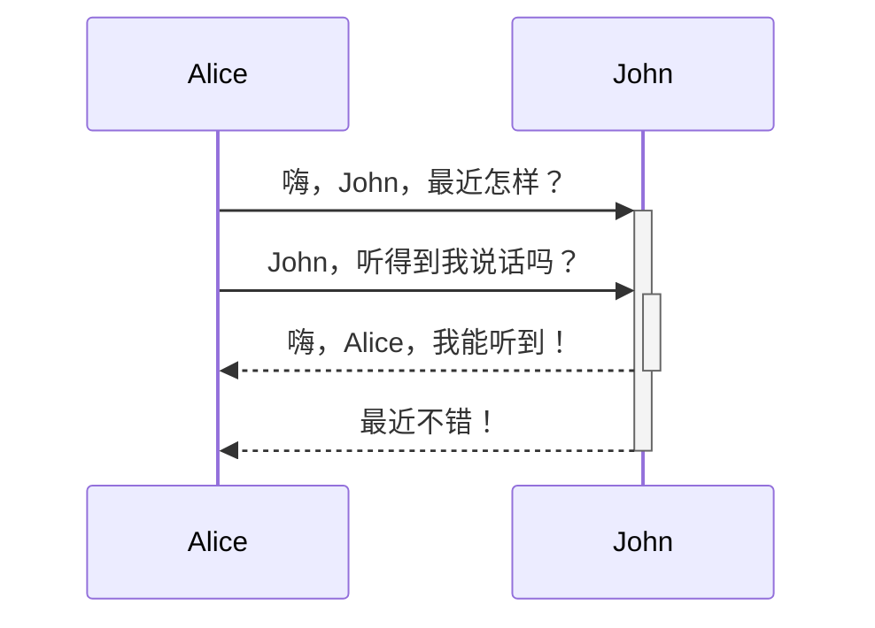

## 常用
>1.使用">"键
>>自动归类
>>>分级

转义符"\\"作用是将符号正常文本显示 
#关键词使用"#"tag关联  tag仅仅是一个可点击的快捷查询
双链(实现软件内部双链关联 )写法:
[[快捷键]] [跳转到其他文件夹的写法](常用概念)
[跳转到正则表达式](../正则表达式.md)   使用相对路径 文件名.md   [文字](<file:///绝对路径>)，加<>可以解决中文路径和空格等问题
[跳转到如软路由](../../网络工程/网络通信/软路由.md)  也可以使用绝对路径
[[使用   ^^  链接笔记文本块,单个   ^  是本地连接]]
[[Redis原理#^a6923c]]
[方括号--外部引用链接](http://www.baidu.com)
<i>nihao</i>
_斜字_ 
===高亮===
1. 有序列表
	1. tab缩进
2. shift+tab取消缩进
- 无序列表
图片大小调整可在png后加上  |数字大小调整 要么就使用css编码
--- 
| :标题   | :  居中                     : |         |
| ------- | ----------------------------- | ------- |
| 单元格1 | 单元格2                       | 单元格3 |
|         |                               |         |
- [x] 任务栏1
- [ ] 任务栏2
简单内部脚注^[简单内部脚注]
脚注效果[^1]
脚注效果2 [^abc]
代码脚注[^u]

[^1]:第一个脚注
[^abc]:名字为abc的脚注
[^u]:1221

##### 注意:
markdown语法可能导致复制进来的<英文>被识别成css语法导致图片链接失效而视图模式又可用,此时自行到<标签内随意加^符号即可> ^ecfec9

## 不常用,CSS语法

<u>下划线使用格式使用    前端标签格式u  </u>

文本

<h1>标题</h1>

~~123123~~

你好
***加重
**小加重
半方大的空白&ensp;或&#8194  首行缩进
<small>小字</small>

#语法 333333333
